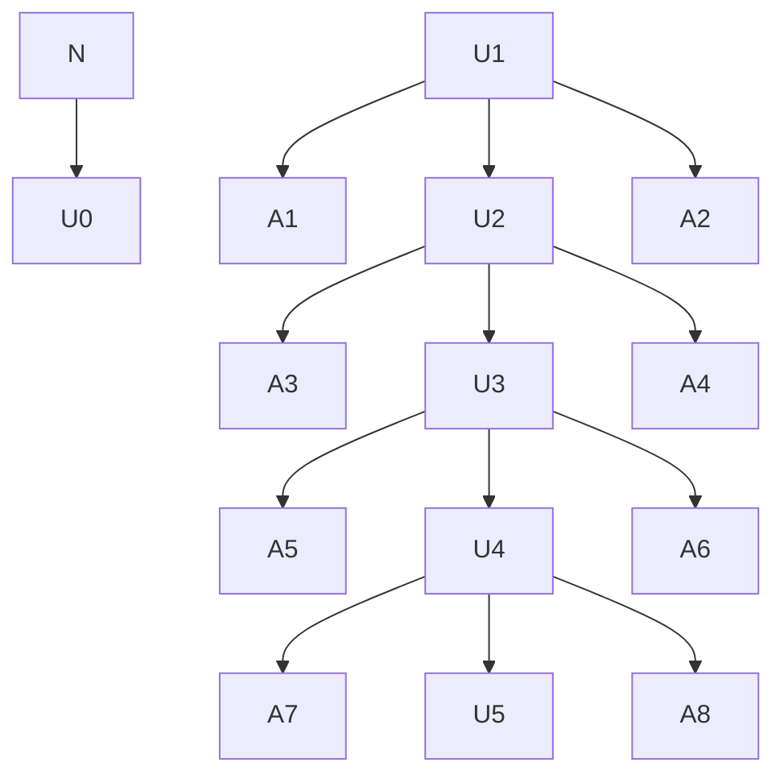

# Introduction + Background theory
Neutrons glaze... 

In order to study neutrons, experiments such as UCNTau+ and nEDM require an efficient means of transporting neutrons from their source. In other words, few neutrons should be lost during the transportation process. On the other hand, the neutron source shouldn't produce so many neutrons that it blows up.
Furthermore, when neutrons interact with low-enriched Uranium (LEU), they can fission which produces more neutron(s). As neutrons fission and create more neutrons, the new generation of neutrons can go onto fission themselves. This process is called a chain reaction and is depicted in Fig. 1. Furthermore, the ratio of neutrons in the current generation to the previous generation, called $k_{eff}$, is used to describe the efficiency of a neutron source and whether or not it is safe. This parameter is dependant on the materials used in the source as well as the geometry.


Chain Reaction Diagram

<p align="center">
  Figure 1: <em>The initial neutron fissions with U92 creating 3 more neutrons. Two of those neutrons go off into space but one of them fissions with U92 again. This process repeats itself.</em>
</p>

---

When $k_{eff}$ exceeds 1, the chain reaction blows up and the system is said to have reached criticality. To maintain safety, a safety threshold is defined near $k_{eff}$ = 1. So, ideally a neutron source should exhibit a $k_{eff}$ value at its safety threshold. 

Monte-Carlo simulations

The Monte Carlo N-Particle (MCNP) code uses Monte Carlo simulations to estimate $k_{eff}$ for a given geometry and materials. In this code, the processes of many individual neutrons are simulated and the individual $k_{eff}$'s are averaged.

Each process involves imposing random walks on a neutron, modeling interactions after each step of the walk, and tracking the number of the new neutrons produced if it fissions. The interaction amplitudes are contained in a large of collection of data to which the MCNP code uses to calculate the probability of an interaction at the given initial and final momenta of the step.


This project uses the MCNP code to analyze $k_{eff}$ across various geometries of an 18kg mass of low enriched Uranium. Researches at LANL are exploring this as a way to boost the number of ultracold neutrons (UCNs) generated at LANSCE, and the neutron source of course needs to avoid criticality. Thus this project aims to generate a geometry that achieves critically to demonstrate that a geometry exists that is close to critically. Altogether, the optimal geometry should bring $k_{eff}$ as close as safely possible to criticality at $k_{eff} = 1$, and generating a geometry that achieves criticality will demonstrate this is likely possible.


# Procedure

The MCNP code takes input files in which surface, cell, and data cards are defined. 

The surface cards define surfaces with given shape and position. For example the surface card below defines a set of cylindrical surfaces centered on the Z axis with radii: 7 cm, 14 cm, 21 cm, and 28 cm.

```
c SURFACE CARDS
$ CellID   Shape/Position   Radius
1   CZ   7.000                                  
2   CZ   14.000
3   CZ   21.000
4   CZ   28.000
```

The cell cards you tell it about each cell or volume. Below are cells of the volumes between each cylindrical surface...

```
c CELL CARDS
$ SurfaceID   Material   Density   Inside:Outside   Track/kill
10   100  -18.74  1 : -2      imp:n=1                      
20   200  -1.0    2 : -3      imp:n=1                    
30   100  -18.74  3 : -4      imp:n=1                    
40   0            +4          imp:n=0                    
```

The data cards you tell it what to calculate and also define your materials. Below we have defined a mix of U235 and U238 and water.
```
c DATA CARDS
$ Number histories per cycle     Initial Guess keff     Number Cycles to Skip Before Tallying     Total Cycles
kcode 10000  1.0  1000  1100
$ Initial position (x, y, z)      
ksrc  0.0  0.0  0.0   
$ Material     Atomic number and number of neutrons     Percent
m100  92235 -.9473       
      92238 -.0527
m200  1001   2 
      8016   1
```


We changed the geometries in the surface and cell cards. And estimated $k_{eff}$

For different geometries and mediating materials, we estimated $k_{eff}$.

# Analysis
Using the MCNP code, we estimated $k_{eff}$ for various geometries. For our notable geometries, $k_{eff}$ ranges ().

Label notable geometries A, B , C ...

Describe those geometries

Figures of qt plots of each geometry.

Bar chart of geometry vs $k_{eff}$

The max $k_{eff}$ is

# Conclusions
In retrospect, efficient neutron transportation is vital to many modern physics experiments. The parameter, $k_{eff} = \frac{ neutrons current generation}{ neutrons previous generation}$ essentially describes the efficiency of a neutron source. If $k_{eff}$ exceeds 1 then the neutron source will inevitably blow up. This threshold is called criticality. Thus, for safety in neutron sources, $k_{eff}$ is given a safety threshold. 

Researchers at LANL are interested in using an 18 kg mass of Uranium to booost the number of UCNs generated at LANSCE. Thus, we aim to demonstrate a geometry that results in criticality. By generating a geometry that results in criticality, we will show that a geometry exists to make a safe and efficient neutron source with 18 kg of Uranium.

We used the MCNP code to model geometries for which we estimated $k_{eff}$. Our modeled neutron source with 18 kg of LEU yields a $k_{eff}$ value of ---. This shows that a geometry exists that yields a $k_{eff}$ at the safety threshold.