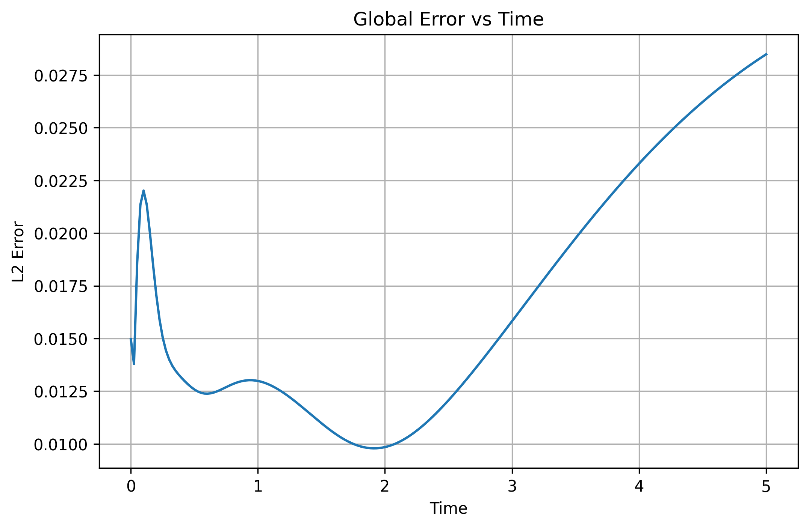
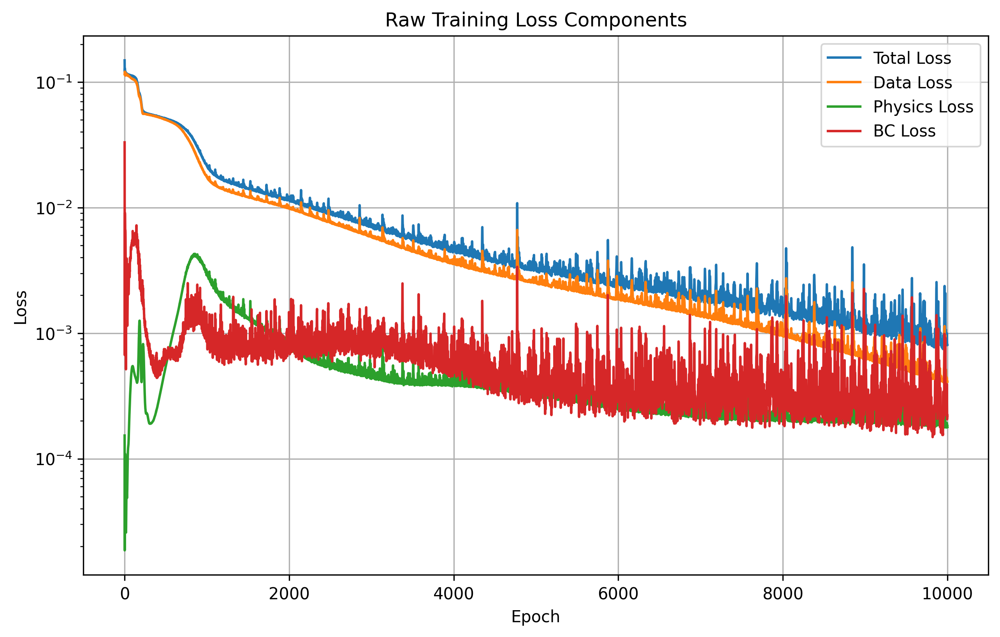
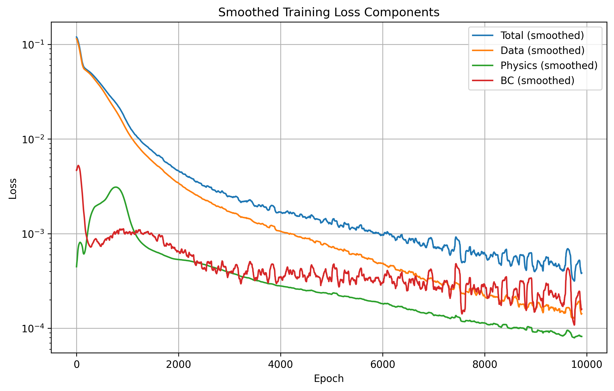
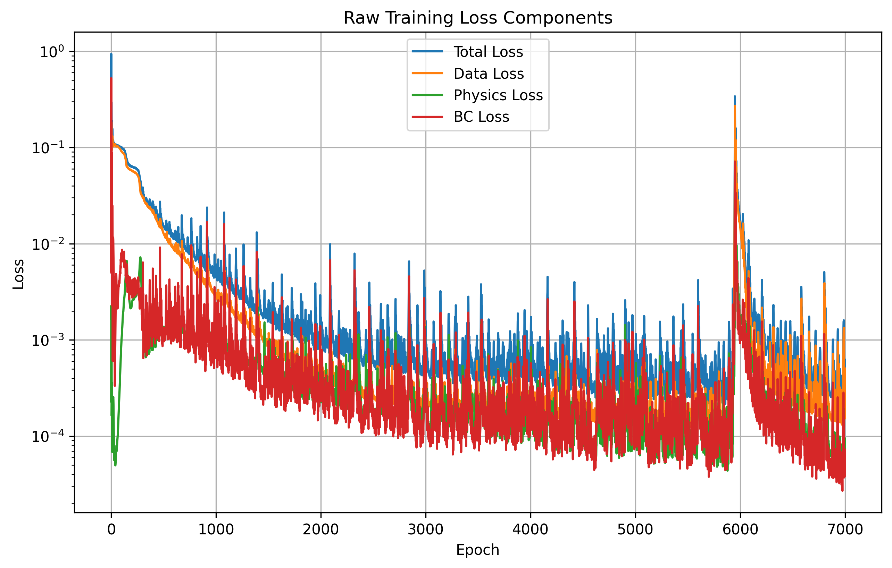
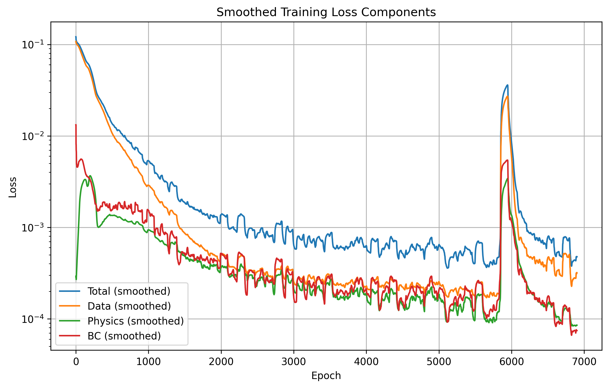
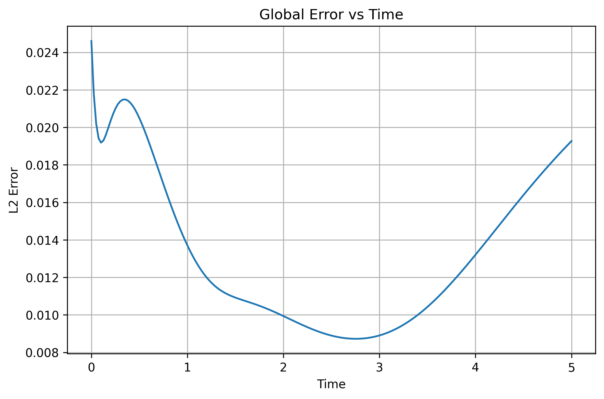

# **Physics-Informed Neural Networks (PINNs)**

# Abstract
Physics-Informed Neural Networks (PINNs) are a class of machine learning models that integrate physical laws into the training process. By embedding the governing mathematical equations of physical systems directly into the loss function, PINNs can learn complex relationships from data while adhering to known physical constraints. This project studies the architecture of PINNs, their training methodologies, and their applications in solving problems in physics.

---

# 1. Introduction

## 1.1 Motivation
Traditional numerical methods for solving partial differential equations (PDEs), such as finite difference and finite element methods, can be computationally expensive and may struggle with high-dimensional problems or complex geometries. PINNs offer a promising alternative by leveraging the power of neural networks to approximate solutions to PDEs while incorporating physical knowledge directly into the learning process. 

### 1.1.1 Finite Element Method (FEM) and Finite Difference Method (FDM)
The Finite Element Method (FEM) is a broad numerical analysis method for solving partial differential equations. FEM subdivides a large problem into smaller, more managable parts called finite elements. This is done by discretizing the spatial domains into meshes, which can be of various shapes (e.g., triangles, quadrilaterals). The solution is approximated by minimizing some *error function* using calculus of variations. FEM is particularly effective for problems with complex geometries and boundary conditions.

The Finite Difference Method (FDM) is a numerical technique for solving differential equations by approximating derivatives with finite differences. FDM discretizes the spatial and temporal domains into a grid and replaces the continuous derivatives in the PDEs with finite difference approximations. This method is straightforward and easy to implement, making it suitable for simple geometries and problems with regular grids. However, FDM can struggle with complex geometries and may require fine grids to achieve high accuracy, leading to increased computational costs.


### 1.1.2 How PINNs differ from traditional numerical methods
Firstly, PINNs leverage the universal function approximation capabilities of **neural networks** to learn complex relationships in data, while traditional numerical methods rely on discretization techniques to solve PDEs. PINNs can also handle high-dimensional problems and complex geometries more effectively than traditional methods, which may require significant computational resources for such cases. PINNs can incorporate noisy or incomplete data into the training process, allowing for more flexible modeling of real-world phenomena, whereas traditional methods typically require well-defined boundary conditions and initial conditions. Additonally, PINNs can be trained using gradient-based optimization algorithms, which can lead to faster convergence compared to iterative solvers used in traditional numerical methods.


## 1.2 Neural Network as Function Approximators
$u_\theta(x,y,t)$ represents the neural network approximation of the solution to the PDE, where $\theta$ denotes the network parameters. The neural network takes the spatial coordinates $(x,y)$ and time $t$ as inputs and outputs the predicted solution $u_\theta$. This output is then compared to the true solution to compute the loss function. The total losses are a measure of the accuracy of the neural network in approximating the solution. During training, these losses are used to update the network parameters through backpropagation. The architecture of the neural network, including the number of layers, neurons, and activation functions, is designed to capture the underlying physics of the problem while ensuring that the model can learn effectively from the data. The choice of activation functions is crucial for enabling the network to learn complex patterns and relationships in the data, which is essential for accurately approximating the solution to the PDE. 


## 1.3 Neural Network Training
Loss minimization, backpropagation, and optimization algorithms are key components of training neural networks. 

### 1.3.1 Loss function
The loss function quantifies the difference between the predicted output and the true output, guiding the optimization process to adjust the network's parameters for improved performance. There are several contributing factors to the total loss of an output, including the data loss, physics loss, initial condition loss, and boundary condition loss. The data loss measures the discrepancy between the predicted solution and the observed data, while the physics loss quantifies how well the predicted solution satisfies the governing PDE. The initial condition loss and boundary condition loss ensure that the predicted solution adheres to the specified initial and boundary conditions, respectively. By **minimizing** this total loss during training, the neural network can learn to approximate the solution to the PDE while respecting the underlying physical constraints.

### 1.3.2 Backpropagation
The backpropagation algorithm computes the **gradients** of the loss function with respect to the network's parameters, allowing for efficient updates during training. This is done by applying the chain rule of calculus to propagate the error from the output layer back through the hidden layers to the input layer. The computed gradients are then used by optimization algorithms to adjust the parameters in a way that minimizes the loss function, ultimately improving the model's performance in approximating the solution to the PDE. To paraphase from **3Blue1Brown**, backpropagation is a method for efficiently computing the gradient of the loss function with respect to the parameters of the neural network, which is essential for training the model using gradient-based optimization algorithms.

### 1.3.3 Optimization algorithms
Optimization algorithms, such as stochastic gradient descent (SGD) or **Adam**, are used to iteratively minimize the loss function and enhance the model's accuracy. These algorithms adjust the network's parameters based on the computed gradients from backpropagation, allowing the model to learn from the data and improve its predictions over time. The choice of optimization algorithm can significantly impact the convergence speed and overall performance of the neural network, making it an important consideration in the training process. 

Again, in the words of **3Blue1Brown**, the optimization algorithm is comparable to a hiker trying to find the lowest point in a landscape, where the loss function represents the landscape and the parameters of the neural network represent the hiker's position. The optimization algorithm guides the hiker towards the lowest point by following the gradients of the loss function, ultimately leading to a better approximation of the solution to the PDE. Certain factors, such as the choice of learning rate, can influence the effectiveness of the optimization algorithm, and require tuning to achieve optimal performance. These tuning parameters can make the hiker's decent very accurate, but slow, or very fast, but inefficient, and may even cause the hiker to diverge from the lowest point if not chosen carefully. **3Blue1Brown** compares it to a drunk man stubling down a hill versus a very careful and calculating gentleman that chooses his steps precisely. 


## 1.4 Physics-Informed Neural Networks (PINNs)
The *physics-informed* aspect of PINNs refers to the incorporation of physical laws, such as conservation of energy or mass, into the training process. This is achieved by including terms in the loss function that penalize deviations from the governing PDEs, ensuring that the predicted solutions not only fit the data but also adhere to known physical principles. These losses can also be biased to prioritize certain aspects of the solution, such as fitting the data more closely or ensuring that the PDE is satisfied more accurately. By embedding physical knowledge directly into the training process, PINNs can achieve better generalization and robustness, especially in scenarios where data may be scarce or noisy (which is often the case in real-world applications). This approach allows PINNs to leverage both data and physics to learn complex relationships and make accurate predictions, making them a powerful tool for solving PDEs in various scientific and engineering domains.


## 1.5 Application, Advantages, and Limitations of PINNs
PINNs have been successfully applied to a wide range of problems in physics, engineering, and other scientific domains. They have been used to solve PDEs in fluid dynamics, heat transfer, electromagnetics, and many other areas. The advantages of PINNs include their ability to handle high-dimensional problems, incorporate physical knowledge directly into the training process, and learn from noisy or incomplete data. However, PINNs also have limitations, such as the need for careful tuning of hyperparameters, potential issues with convergence, and the requirement for sufficient computational resources for training. Despite these challenges, PINNs represent a promising approach for solving complex PDEs and have the potential to revolutionize the way we model and understand physical systems.

---

# 2. Problem Formulation

## 2.1 Governing Equations
The two dimensional heat equation is given by:
```math
\frac{\partial u}{\partial t} = \alpha \left( \frac{\partial^2 u}{\partial x^2} + \frac{\partial^2 u}{\partial y^2} \right)
```
where $u(x,y,t)$ is the temperature distribution, $\alpha$ is the thermal diffusivity, and $t$ is time. This equation describes how heat diffuses through a given region over time, making it a fundamental model in various fields such as physics, engineering, and environmental science. The goal of this project is to use PINNs to solve the 2D heat equation under specific initial and boundary conditions, demonstrating the effectiveness of this approach in capturing the underlying physics of the problem.

## 2.2 Initial and Boundary Conditions
The **initial condition** for the 2D heat equation is defined as:
```math
u(x,y,0) = f(x,y)
```
where $f(x,y)$ is a Gaussian function representing the initial temperature distribution. 

The **boundary conditions** can be of two types: Dirichlet and Neumann. The Dirichlet boundary condition specifies the temperature at the boundaries, while the Neumann boundary condition specifies the heat flux across the boundaries. For example, the Dirichlet boundary conditions can be expressed as:
```math
u(x,0,t) = u(x,L_y,t) = u(0,y,t) = u(L_x,y,t) = 0.
```
Which fix the temperature at the boundaries to zero. On the other hand, the Neumann boundary conditions can be expressed as:

```math
\frac{\partial u}{\partial n} = 0
```
for Neumann boundary conditions, where $\frac{\partial u}{\partial n}$ denotes the derivative of $u$ normal to the boundary. This condition implies that there is no heat flux across the boundaries, meaning that the temperature gradient normal to the boundary is zero. The choice of boundary conditions depends on the physical scenario being modeled and can significantly influence the solution of the PDE. In this project, both types of boundary conditions are studied to demonstrate the versatility of PINNs in solving PDEs under different constraints.


## 2.3 Analytical Solution
The analytical solution to the **2D heat equation** with Gaussian initial conditions can be derived using separation of variables and Fourier series. The solution is given by:
```math
u(x,y,t) = 
```
where $f(\xi,\eta)$ is the initial temperature distribution and where $\xi$ and $\eta$ are dummy variables of integration representing the spatial coordinates. This solution represents the evolution of the temperature distribution over time, starting from the initial Gaussian profile. The integral form of the solution indicates that the temperature at any point $(x,y)$ and time $t$ is influenced by the initial conditions across the entire spatial domain, weighted by a Gaussian kernel that accounts for the diffusion process. This analytical solution serves as a benchmark for evaluating the performance of PINNs in approximating the solution to the 2D heat equation under the specified conditions.

## 2.3 Analytical Solution 

To validate the Physics-Informed Neural Network (PINN), an analytical solution to the two-dimensional heat equation is constructed for the same domain and boundary conditions.


### 2.3.1 Governing Equation

The temperature field $u(x,y,t)$ satisfies the diffusion equation:
```math
\frac{\partial u}{\partial t} = \alpha \left( \frac{\partial^2 u}{\partial x^2} + \frac{\partial^2 u}{\partial y^2} \right)
```

on the square domain $x,y \in [0,1]$, subject to homogeneous Neumann boundary conditions:

```math
\frac{\partial u}{\partial n} = 0 \quad \text{on all boundaries}
```

which physically correspond to an insulated domain (no heat flux across the boundary).

     NOTE: The program can be easily modified to handle Dirichlet boundary conditions by changing the basis functions and eigenvalues accordingly. For the purposes of the report, focus will remain on the Neumann case, but remember that the code to implement the Dirichlet case is also available in the notebook, just commented out.

---

### 2.3.2 Separation of Variables and Eigenfunction Expansion

Due to linearity and homogeneous boundary conditions, the solution may be expressed as a series of spatial eigenfunctions. For Neumann boundary conditions, the appropriate basis functions are cosine modes:

```math
\phi_{mn}(x,y) = \cos(m\pi x)\cos(n\pi y), \quad m,n = 0,1,2,\dots
```

Substituting a separable solution $u(x,y,t) = X(x)Y(y)T(t)$ into the governing equation leads to eigenvalues:

```math
\lambda_{mn} = \pi^2 (m^2 + n^2)
```

and exponential temporal decay of each mode. The general solution is therefore:

```math
u(x,y,t) = \sum_{m=0}^{\infty} \sum_{n=0}^{\infty}
C_{mn}\,\cos(m\pi x)\cos(n\pi y)\,e^{-\alpha \pi^2 (m^2 + n^2)t}
```

---

### 2.3.3 Determination of Coefficients

The coefficients $C_{mn}$ are determined by projecting the initial condition onto the cosine basis:

```math
C_{mn} =
\int_0^1 \int_0^1
u(x,y,0)\,\cos(m\pi x)\cos(n\pi y)\,\mathrm{d}x\,\mathrm{d}y
```

For this project, the initial condition consists of two Gaussian peaks:

```math
u(x,y,0) =
T_{\max}\,e^{-A[(x-0.3)^2 + (y-0.3)^2]} +
T_{\max}\,e^{-A[(x-0.7)^2 + (y-0.7)^2]}
```

The integrals for $C_{mn}$ are evaluated numerically using a two-dimensional trapezoidal rule over a uniform grid.

     NOTE: Although the discussion of solving for and implementing the analytical solution is interesting, it is not strictly necessary for the project, as the main focus is on the implementation and performance of the PINN. However, having an analytical solution provides a valuable benchmark for evaluating the accuracy of the PINN and understanding the underlying physics of the problem. The code to compute the analytical solution is included in the notebook for completeness, but it can be commented out if desired without affecting the core functionality of the PINN implementation.

     NOTE: For the purposes of demonstrating the accuracy of the PINN, multiple unique initial conditions (and even boundary conditions) where implemented, tested, and reported on. For the sake of brevity, only one set of initial conditions (the two Gaussian peaks) is discussed in the report.

---

### 2.3.4 Numerical Implementation

Since the infinite series is not tractable in practice, the solution is approximated by truncating the expansion:

```math
u(x,y,t) \approx
\sum_{m=0}^{M} \sum_{n=0}^{N}
C_{mn}\,\cos(m\pi x)\cos(n\pi y)\,e^{-\alpha \pi^2 (m^2 + n^2)t}
```

where $M$ and $N$ are chosen to balance accuracy and computational cost.

To improve efficiency:
- Coefficients $C_{mn}$ are precomputed once  
- Spatial basis functions $\cos(m\pi x)\cos(n\pi y)$ are cached  
- Time evolution is applied via exponential decay factors  

---

### 2.3.5 Physical Interpretation

Each term in the series represents a spatial mode that:
- Satisfies the boundary conditions exactly  
- Decays exponentially in time  
- Contributes to the overall diffusion process  

This analytical solution is consistent with the imposed Neumann boundary conditions and serves as a physically accurate benchmark for evaluating the PINN. The truncation of the series introduces a controllable approximation error, which decreases as the number of retained modes increases.

---

# 3. Architecture of PINNs

## 3.1 Neural Network Structure and Layers
The architecture of a Physics-Informed Neural Network (PINN) typically consists of multiple layers, including an input layer, several hidden layers, and an output layer. The input layer receives the spatial and temporal coordinates (e.g., $x$, $y$, and $t$), while the output layer produces the predicted solution (e.g., temperature $u_\theta$). The hidden layers can be fully connected or may include other types of layers such as convolutional or recurrent layers, depending on the specific problem being addressed. The choice of *activation functions* in the hidden layers is crucial for capturing the non-linear relationships in the data and ensuring that the network can learn complex patterns effectively. 

<figure>
  
  
  <figcaption><strong>Figure 1.</strong> Neural network visualization from Brody Codes AI.</figcaption> 

  [Brody Codes AI](https://www.youtube.com/watch?v=WRSNrVH0wg8)
</figure>


## 3.2 Activation Functions

Activation functions are mathematical functions applied to the output of each neuron in the hidden layers. Common activation functions include `ReLU`, `sigmoid`, and `tanh`, each with its own advantages and disadvantages in terms of convergence and performance. The `ReLU` activation function is computationally efficient and helps mitigate the vanishing gradient problem, but it can lead to dead neurons. The `sigmoid` function maps inputs to a range between 0 and 1, which can be useful for binary classification tasks but may suffer from vanishing gradients. The `tanh` function maps inputs to a range between -1 and 1, providing a zero-centered output that can help with convergence during training.

Usually, when building a PINN, the `tanh` activation function is often chosen for the hidden layers due to its smoothness and differentiability, which are important for computing derivatives in the PDE loss. The `tanh` function allows the network to capture complex relationships in the data while ensuring that the gradients can be computed effectively during backpropagation, leading to better convergence and performance in approximating the solution to the PDE.

     NOTE: The actual operation of activation functions in the (very involved) context of machine learning is a complex topic that is still an active area of research. The theory behind activation functions is beyond the scope of this project.

## 3.3 Automatic Differentiation
Automatic differentiation is a process in which derivatives of functions (generally the loss function with respect to the network parameters) are computed automatically by the machine learning framework (e.g., PyTorch in this case). This is essential for training PINNs, as it allows for efficient computation of gradients needed for backpropagation. Automatic differentiation works by breaking down complex functions into a sequence of elementary operations and applying the chain rule of calculus to compute derivatives efficiently. This enables the PINN to *learn* from data while ensuring that the predicted solutions satisfy the governing PDEs, as the derivatives required for the physics-informed loss can be computed accurately and efficiently during training.

This is a complex process that is still an active area of research, and the implementation methods vary depending on the machine learning framework being used. However, the key advantage of automatic differentiation is that it allows for the efficient computation of gradients. *Gradient descent* is a common term used for the *optimization* process in which these gradients are used to find some local minimum in the *loss landscape*. The inner workings of this process are beyond the scope of this report, but it is important to note that automatic differentiation is a fundamental component of the training process for PINNs and plays a critical role in their ability to solve PDEs accurately and efficiently.


## 3.4 Loss Function

The training of a Physics-Informed Neural Network (PINN) is formulated as an optimization problem in which the neural network is trained to satisfy both observed data constraints and governing physical laws. This is achieved by constructing a composite loss function consisting of multiple physically motivated terms.

In this implementation, the neural network approximates the temperature field, $u_\theta(x,y,t)$, and is trained such that it simultaneously:
- Matches the initial condition data
- Satisfies the heat equation
- Enforces Neumann boundary conditions

---

### 3.4.1 PDE Residual Loss

The governing equation for the system is the 2D heat equation:
```math
\frac{\partial u}{\partial t} = \alpha \left(\frac{\partial^2 u}{\partial x^2} + \frac{\partial^2 u}{\partial y^2}\right)
```

The PINN enforces this constraint by minimizing the residual:
```math
r(x,y,t) = u_t - \alpha (u_{xx} + u_{yy})
```

In the code, this is implemented using automatic differentiation:
```python
u_x = grads[:,0:1]
u_y = grads[:,1:2]
u_t = grads[:,2:3]

u_xx = torch.autograd.grad(...)[0][:,0:1]
u_yy = torch.autograd.grad(...)[0][:,1:2]

physics_loss = torch.mean((u_t - alpha * (u_xx + u_yy))**2)
```

This term ensures that the learned solution satisfies the governing PDE at randomly sampled collocation points in the domain.

---

### 3.4.2 Initial Condition Loss

The initial condition specifies the temperature distribution at $t = 0$ as two Gaussian peaks:
```math
u(x,y,0) = T_{\max} \left(e^{-A[(x-x_1)^2 + (y-y_1)^2]} + e^{-A[(x-x_2)^2 + (y-y_2)^2]}\right)
```
In the implementation, this is enforced by evaluating the neural network at $t=0$:
```python
u_pred_data = model(X_data)
data_loss = torch.mean((u_pred_data - u_data)**2)
```
This term ensures that the predicted solution matches the specified initial temperature distribution.

---
### 3.4.3 Boundary Condition Loss

The system enforces homogeneous Neumann boundary conditions:
```math
\frac{\partial u}{\partial n} = 0 \quad \text{on all boundaries}
```
This corresponds physically to an insulated domain where no heat flux leaves the system.

Unlike Dirichlet conditions, Neumann conditions are enforced through spatial derivatives of the network output. Using automatic differentiation, the normal derivatives at the domain boundaries are computed:
```python
du_dx_left  = grad_left[:,0:1]
du_dx_right = grad_right[:,0:1]
du_dy_bottom = grad_bottom[:,1:2]
du_dy_top    = grad_top[:,1:2]
```
The boundary condition loss is then defined as the mean squared error of these derivatives:
```python
bc_loss = (
    torch.mean(du_dx_left**2) +
    torch.mean(du_dx_right**2) +
    torch.mean(du_dy_bottom**2) +
    torch.mean(du_dy_top**2)
)
```
This term ensures that the predicted solution satisfies the Neumann boundary conditions, effectively modeling an insulated domain.

---

### 3.4.4 Total Loss

The final objective function is a weighted sum of all constraints:
```math
\mathcal{L}_{\text{total}} = \lambda_{\text{data}} \mathcal{L}_{\text{data}} + \lambda_{\text{physics}} \mathcal{L}_{\text{physics}} + \lambda_{\text{BC}} \mathcal{L}_{\text{BC}}
```
Implemented in code as:
```python
loss = (lambda_data * data_loss) + 
       (lambda_phys * physics_loss) +
       (lambda_bc * bc_loss)
```

Each term plays a distinct role:
- Data loss enforces the initial condition,
- Physics loss enforces the PDE constraint,
- Boundary loss enforces insulation conditions.

The weighting coefficients $\lambda_i$ control the relative importance of each constraint and can significantly influence convergence behavior and solution accuracy.

---

# 4. Implementation Details

This section describes the computational implementation of the Physics-Informed Neural Network (PINN) used to solve the 2D heat equation, including the software framework, neural network design, and training procedure.


## 4.1 Software
The implementation was developed in Python using the **PyTorch** deep learning framework. PyTorch is particularly well-suited for PINNs due to its support for:
- **Automatic differentiation (autograd)** for computing spatial and temporal derivatives of the neural network output
- **Gradient-based optimization** for training the model
- **Efficient tensor operations** for large-scale numerical computation
- **GPU acceleration** (when available) for improved performance
In this project, PyTorch is used to train the neural network but also to enforce the partial differential equation describing the physical phenomena.

Supporting libraries include:
- `NumPy` for numerical operations and analytical solution computation
- `Matplotlib` for visualization and animation of results

---

## 4.2 Network Architecture

The PINN approximates the temperature field, $u_\theta(x,y,t) $, using a fully connected feedforward neural network.

### 4.2.1 Structure

The implemented architecture consists of:

- **Input layer:** 3 neurons \((x, y, t)\)
- **Hidden layers:** 3 layers, each with 64 neurons
- **Activation function:** Hyperbolic tangent (Tanh)
- **Output layer:** 1 neuron representing \(u(x,y,t)\)

Easily implemented in PyTorch as:
```python
class PINN(nn.Module):
    def __init__(self):
        super().__init__()
        self.net = nn.Sequential(
            nn.Linear(3, 64),       # 3 input features: (x,y,t)
            nn.Tanh(),              # Activation function: Tanh
            nn.Linear(64, 64),      # Hidden layer with 64 neurons
            nn.Tanh(),              # Activation function: Tanh
            nn.Linear(64, 64),      # Hidden layer with 64 neurons
            nn.Tanh(),              # Activation function: Tanh
            nn.Linear(64, 1)        # 1 output feature: u(x,y,t)
        )

    def forward(self, x):
        return self.net(x)
```

### 4.2.2 Explanation of Design Choices

Firstly, like many other aspects of this project, the network architecture is a free parameter that can be studied and tuned for optimal performance. Several structures were implemented and tested, including variations in the number of hidden layers, neurons per layer, and activation functions. The chosen architecture (3 hidden layers with 64 neurons each and Tanh activation) was found to provide a good balance between model capacity and training stability for this specific problem. 
- The **Tanh activation function** is used because it produces smooth, differentiable outputs, which is essential for computing higher-order derivatives required in the PDE residual.
- A moderate depth (3 hidden layers) is used to balance:
  - Function approximation capacity
  - Training stability
  - Computational efficiency

---

## 4.3 Training Methodology

The training process is an interative process in which the neural network parameters (weighting matrixies, bias vectors, etc.) are updated to minimize the total loss function. The update is based on the computed gradients of the loss function and continues until a local minimum is reached or a specified number of `epochs` (complete passes through the training data) is completed.

### 4.3.1 Sampling Data Points

Three distinct types of training points are used:

1. Initial Condition Points
     - These enforce the known solution at t=0.
     - ```python
          x_data = torch.rand(N_data, 1)
          y_data = torch.rand(N_data, 1)
          t_data = torch.zeros_like(x_data)    
          X_data = torch.cat([x_data, y_data, t_data], dim=1)
          u_data = initial_condition(x_data, y_data, A, temp_min, temp_max)
       ```
          - The initial condition is sampled at random spatial locations with time fixed at zero, ensuring that the neural network learns to match the specified initial temperature distribution.

2. Collocation Points
     - These points are used to enforce the PDE residual at random locations within the domain.
     - ```python
          N_col = 2000                                                # Number of collocation points (points used to enforce PDE)
          x_col = torch.rand(N_col, 1)
          y_col = torch.rand(N_col, 1)
          t_col = tmax * torch.rand(N_col, 1)
          X_col = torch.cat([x_col, y_col, t_col], dim=1)             # Combine x, y, and t for collocation points
       ```
          - Uniform random sampling across space-time domain is used to compute the PDE residual loss: $u_t - \alpha (u_{xx} + u_{yy})$ at these points, ensuring that the learned solution satisfies the governing PDE throughout the domain.

3. Boundary Condition Points
     - These enforce the Neumann boundary conditions at the domain boundaries.
     - ```python
          x0       = torch.zeros_like(t_bc)                           # Boundary condition at x=0
          x1       = torch.ones_like(t_bc)                            # Boundary condition at x=1. torch.ones_like 
          y_rand   = torch.rand(N_bc,1)                               # Random points in space for boundary conditions (y values for x=0 and x=1)

          X_left   = torch.cat([x0, y_rand, t_bc], dim=1)             # Combine x=0, random y, and time for left boundary condition points
          X_right  = torch.cat([x1, y_rand, t_bc], dim=1)             # Combine x=1, random y, and time for right boundary condition points

          y0       = torch.zeros_like(t_bc)                           # Boundary condition at y=0
          y1       = torch.ones_like(t_bc)                            # Boundary condition at y=1
          x_rand   = torch.rand(N_bc,1)                               # Random points in space for boundary conditions (x values for y=0 and y=1)

          X_bottom = torch.cat([x_rand, y0, t_bc], dim=1)             # Combine random x, y=0, and time for bottom boundary condition points
          X_top    = torch.cat([x_rand, y1, t_bc], dim=1)             # Combine random x, y=1, and time for top boundary condition points
       ```
          - Random sampling along the boundaries ensures that the Neumann conditions are enforced across the entire boundary, rather than just at a few fixed points, leading to a more accurate representation of the insulated domain.

### 4.3.2 Training Process

#### Optimizer and Learning Rate
The **Adam** optimizer is used for training the PINN, which is a popular choice for training deep learning models due to its adaptive learning rate and momentum properties. The optimizer updates the network parameters based on the computed gradients of the loss function, allowing for efficient convergence towards a local minimum.
```python
optimizer = torch.optim.Adam(model.parameters(), lr=0.001)
```
This optimizer differs from the classic stochastic gradient descent (`SGD`) by maintaining a moving average of the gradients and their squares, which helps to stabilize the training process and often leads to faster convergence. These features are often referred to as "adaptive learning rates" and "momentum", respectively, and can help the model navigate the loss landscape more effectively, especially in cases where the loss function is complex or has many local minima.

The learning rate of `0.001` is a common default choice for the Adam optimizer, but it can be tuned based on the specific problem and dataset to achieve better performance. 

#### Epochs
The training process is run for a specified number of epochs, which represents the number of complete passes through the training data. In this implementation, the model is trained for `10,000` epochs. Each of which consists of:
- Forward pass: The input data is passed through the network to compute the predicted solution.
- Loss computation: The total loss is computed based on the data loss, physics loss, and boundary condition loss.
- Backward pass: The gradients of the loss with respect to the network parameters are computed using backpropagation.
- Parameter update: The optimizer updates the network parameters based on the computed gradients.

### 4.3.3 Boundary Condition Enforcement
The Neumann boundary conditions are enforced by computing the derivatives of the network output at the boundaries and including these in the loss function. The computed derivatives are then used to define a boundary condition loss term that penalizes deviations from the specified Neumann conditions, ensuring that the learned solution satisfies the physical constraints of an insulated box.
```python
du_dx_left  = grad_left[:,0:1]
du_dx_right = grad_right[:,0:1]
du_dy_bottom = grad_bottom[:,1:2]
du_dy_top    = grad_top[:,1:2]
```
Then the boundary condition loss is defined as:
```python
bc_loss = (
    torch.mean(du_dx_left**2) +
    torch.mean(du_dx_right**2) +
    torch.mean(du_dy_bottom**2) +
    torch.mean(du_dy_top**2)
)
```

---

# 5. Results and Performance Analysis

## 5.1 Visual Comparison of Predicted and Analytical Solutions
Before explaining the accuracy, convergence, and stability of the PINN, it is helpful to visualize the predicted solutions. The following figures show the temperature distribution predicted by the PINN at various time steps, compared to the analytical solution. As seen below, the model is quite visually convincing.

https://github.com/user-attachments/assets/cacaed5a-ea91-4142-b913-71304236383e

<figure>
  <figcaption><strong>Figure 2.</strong> Temperature distribution predicted by the PINN at various time steps, compared to the analytical solution.</figcaption> 
</figure>

---

## 5.2 Quantitative Error Analysis

### 5.2.1 L2 Error Metric

To quantitatively evaluate the accuracy of the PINN, the L2 error norm is used to measure the discrepancy between the predicted solution and the analytical solution over the spatial domain.

Let $ u_{\text{PINN}}(x,y,t) $ denote the neural network prediction and $ u_{\text{true}}(x,y,t) $ the analytical solution. The error field is defined as:
```math
e(x,y,t) = u_{\text{PINN}}(x,y,t) - u_{\text{true}}(x,y,t)
```
The continuous L2 norm of the error over the domain Ω is given by:
```math
\|e(t)\|_{L^2} = \left( \int_{\Omega} |e(x,y,t)|^2 \, \mathrm{d}\Omega \right)^{1/2}
```
In practice, this integral is approximated using numerical quadrature over a discrete grid of points:
```math
\|e(t)\|_{L^2} \approx \left( \frac{1}{N} \sum_{i=1}^{N} |e(x_i,y_i,t)|^2 \right)^{1/2}
```

This cooresponds to the root mean square error (RMSE) between the predicted and true solutions at time $ t $. L2 error is a common metric for evaluating PINNs, because it provides a single scalar value that quantifies the overall discrepancy between the predicted and true solutions, making it easier to compare different models and training configurations. Additionally, the L2 norm is sensitive to large differences (because of the squared term), which can be important for assessing the performance of PINNs in capturing the underlying physics of the problem.

### 5.2.2 Error Evolution Over Time
Plotting the L2 error over time provides insight into how the accuracy of the PINN evolves as the solution changes, and can help identify any trends or issues in the training process.

<figure>
  
  <figcaption><strong>Figure 3.</strong> L2 relative error over time.</figcaption> 
</figure>

With the standard model (3 layers, 64 neurons in each layer, learning rate of 0.001, tanh activation function, 7,000 epochs...), the accuracy of the PINN is quite good, with a relative L2 error on the order of 1e-2. The error increases slightly over time, which is expected due to the nature of the diffusion process and the accumulation of approximation errors. However, the overall low error indicates that the PINN is successfully learning to approximate the solution to the 2D heat equation under the specified initial and boundary conditions.

---

## 5.3 Training and Convergence Behavior

<figure>
  
  
  <figcaption><strong>Figure 4.</strong> Training loss curves (raw and smoothed). Model converges towards a minimum loss value over time.</figcaption> 
</figure>

As seen in the loss curves above, the training process shows a steady decrease in the total loss over time, indicating that the model is learning to satisfy the data, physics, and boundary constraints. The raw loss curve exhibits some noise due to the stochastic nature of the optimization process, while the smoothed curve provides a clearer view of the overall convergence trend. The model appears to converge towards a minimum loss value, suggesting that it is successfully learning to approximate the solution to the 2D heat equation under the specified conditions.

## 5.4 Sensitivity to Hyperparameters
### 5.4.1 Effect of Epochs

https://github.com/user-attachments/assets/51d1487e-8efe-491e-8e40-8aefe91185ff

https://github.com/user-attachments/assets/63027eaa-abf1-4886-9350-9a9cf41f9d45

https://github.com/user-attachments/assets/bf353794-9318-4391-8f64-f782c93860be

<figure>
     <!-- <video controls src="5sec_hot-cold.mp4" title="Title"></video> -->
     <figcaption><strong>Figure 5.</strong> Epochs: 10,000 vs 1,000 vs 500. Other PINN parameters: 0.001 learning rate, 3 hidden layers, 64 neurons per layer. </figcaption>
</figure>

---

### 5.4.2 Effect of Learning Rate

https://github.com/user-attachments/assets/8ffd8262-a7f2-4d9e-9945-d785d17d5c59

https://github.com/user-attachments/assets/41566e93-22f7-4b1a-89d6-d8bfe1958dd2

https://github.com/user-attachments/assets/a880111c-97f0-421a-948b-01e13d974aae

<figure>
     <figcaption><strong>Figure 6.</strong> Learning rate: 0.001 vs 0.005 vs 0.01. Other PINN parameters: 7,000 epochs, 3 hidden layers, 64 neurons per layer.</figcaption>
</figure>

The learning rate can also greatly affect the convergence behavior. At high learning rates, it is possible that the local minima could be overshot to the point that it is hard for the network to find a new minima in the *loss landscape*. 

<figure>
  
  
  <figcaption><strong>Figure 7.</strong> Convergence behavior with a poorly choosen learning rate.</figcaption> 
</figure>

---

### 5.4.3 Effect of Neurons per Layer

https://github.com/user-attachments/assets/601d35c6-efdb-4e67-9e99-b070c290d28f

https://github.com/user-attachments/assets/87bb3451-23e0-4e04-b694-a4f000a39b35

https://github.com/user-attachments/assets/d848d0f4-c717-4ac3-92bb-4b5aff1c5d07

<figure>
     <figcaption><strong>Figure 8.</strong> Neurons per layer: 128 vs 64 vs 8. Other PINN parameters: 7,000 epochs, 0.001 learning rate, 3 hidden layers.</figcaption>
</figure>

---

### 5.4.4 Effect of Hidden Layer Count

https://github.com/user-attachments/assets/470a12a7-da6f-4198-a283-32079ca179ce

https://github.com/user-attachments/assets/3f283529-b843-46ef-9617-b4188cc542f4

https://github.com/user-attachments/assets/fcc5d236-18d5-4472-94d0-e82c95d825bf

<figure>
     <figcaption><strong>Figure 9.</strong> Hidden layers: 3 vs 2 vs 1. Other PINN parameters: 7,000 epochs, 0.001 learning rate, 64 neurons per layer.</figcaption>
</figure>

---

### 5.4.5 Effect of Collocation Points

https://github.com/user-attachments/assets/c328af9b-0ada-4c74-bc31-ab89eac8cf83

https://github.com/user-attachments/assets/d8499d8a-fd62-46c4-8886-7e23f0130b88

<figure>
     <figcaption><strong>Figure 10.</strong> Collocation points: 500 vs 100. Other PINN parameters: 7,000 epochs, 0.001 learning rate, 64 neurons per layer, 3 hidden layers.</figcaption>
</figure>

     For context, $N_{Collocation}=2,000$ was used for most of the results in the report

---

### 5.4.1 Observations

The model is strongly affected by the structure of the network and the training process parameters. There is often a tradeoff between accuracy and computational efficiency, as more complex architectures and longer training times can lead to better approximations of the solution, but at the cost of increased computational resources and time. For example, increasing the number of epochs generally leads to improved accuracy, but with diminishing returns after a certain point. Similarly, increasing the number of neurons per layer can enhance the model's capacity to learn complex patterns, but may also lead to overfitting if not properly regularized. The learning rate is another critical hyperparameter that can influence convergence; too high a learning rate may cause the model to diverge, while too low a learning rate can result in slow convergence. The number of collocation points also plays a significant role in the accuracy of the PINN, as more collocation points can provide a better representation of the PDE residual across the domain, but at the cost of increased computational time for training. There is some fine tuning needed to find the optimal "sweet-spot" for a specific physics problem. 

---

## 5.5 Computational Efficiency and Error

### 5.5.1 Computational Cost
The training time for the PINN is $\mathcal{O}(\text{epochs} \cdot N_{collocation})$. Meaning the training time for the PINN is directly tied the number of epochs and the number of collocation points used to enforce the PDE residual. The computational cost of the analytical solution, which involves evaluating a truncated Fourier series, is $\mathcal{O}(M \cdot N)$, where $M$ and $N$ are the number of modes retained in the series expansion. There is a tradeoff between accuracy and computational efficiency, as increasing the number of epochs, neurons, hidden layers, or collocation points can lead to improved accuracy but also increases the computational resources and time required for training.

Ideally, this method for approximating solutions to a physical phenomena would be compared to another method such as FEM or FDM. However, due to time constraints, this was not implemented. The accuracy of the PINN is quite good, with a relative L2 error on the order of 1e-2, but without a direct comparison to a classical numerical method, it is difficult to fully assess the computational efficiency and error of the PINN in relation to traditional approaches.
- With a few simple modifications, the model produced an L2 error on the order of 1e-3, while only requiring eight minutes of training time (instead of 3-4 minutes), demonstrating the tradeoff between accuracy and efficiency. While this is a significant improvement in accuracy for very little additional training time, it is important to note that this error-training time tradeoff is not linear, and may vary depending on the specific problem, network architecture, and training parameters.

https://github.com/user-attachments/assets/4167ed15-7926-44c4-ab47-c8c477699b68

<figure>
     
     <figcaption><strong>Figure 11.</strong> Improved error model.</figcaption>
</figure>

### 5.5.2 Sources of error
- Approximation error from the neural network architecture (limited capacity to represent complex functions)
- Optimization error (local minima, convergence issues)
- Numerical error in computing derivatives via automatic differentiation
- Truncation error in the analytical solution (finite number of modes)
- Sampling error from finite collocation points
- Hyperparameter sensitivity and tuning
- Computational precision (floating-point errors)
- PINN approximation limits
- Sampling bias


---

# 6. Discussion

The PINN successfully captures the key physical phenomena of the 2D heat equation, including diffusion dynamics, boundary behavior, time evolution, and the initial conditions. To be clear, the PINN does not explicitly "solve" the PDE in the traditional sense, but rather learns an approximation that minimizes the PDE residual across the domain. This allows the PINN to generalize well in space and time and make accurate predictions at random locations and future time steps. However, there are limitations to this approach, including the need for careful tuning of hyperparameters, potential difficulties in capturing high-frequency modes, the fact that the learned solution may not satisfy the PDE exactly at all points, and the increase in error over time due to the diffusive nature of the problem. In practice, PINNs can be a powerful tool for solving PDEs when traditional numerical methods are infeasible or when data is available, but they may not always be the best choice for every problem, especially when high precision is required or when computational resources are limited. The way this PINN is constructed, an evolving physical system may require the PINN to *re-learn* a new solution based on the new conditions. This would add an extremely large computational cost to the problem, and may not be feasible for real-time applications. In contrast, classical numerical solvers can often be more efficient for solving PDEs with fixed conditions, but may struggle with complex geometries or data-driven problems where PINNs can excel.


# 7. Attribution

[FEM](https://en.wikipedia.org/wiki/Finite_element_method)

[FDM](https://en.wikipedia.org/wiki/Finite_difference_method)

